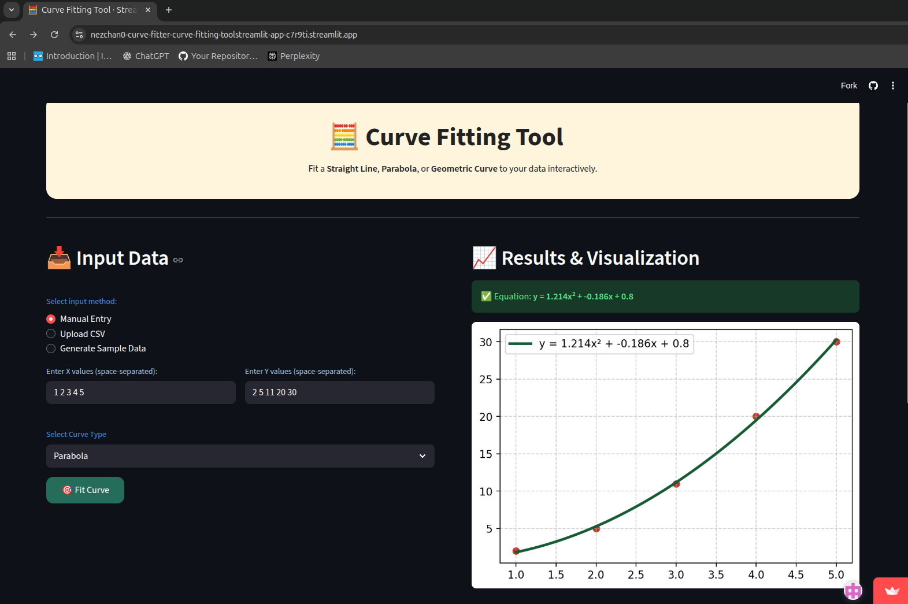

# Curve Fitter Tool 🧮

A simple and interactive Python application for **curve fitting**, built
using **Streamlit** for the GUI and a **CLI tool** for terminal-based
usage.\
It supports fitting **Straight Line**, **Parabolic**, and **Geometric**
curves to given (x, y) data points using least squares approximation.

------------------------------------------------------------------------

## 🧠 Features

✅ Streamlit-based interactive GUI\
✅ Command-line (CLI) mode for terminal users\
✅ Fits multiple curve types:
- **Straight Line:** y = a + bx
- **Parabola:** y = a + bx + cx²
- **Geometric Curve:** y = axᵇ

✅ Displays calculated constants and regression equations\
✅ Visualizes the curve fitting results\
✅ Easy-to-use modular code structure

------------------------------------------------------------------------


## ⚙️ Installation

### 1. Create a virtual environment (recommended)
``` bash
python3 -m venv myenv

source myenv/bin/activate # On Linux/macOS
myenv\Scripts\activate # On Windows
```
### 2. Clone the repository

``` bash
git clone https://github.com/nezchan0/Curve-Fitter.git
cd curve-fitter/Curve-Fitting-Tool
```

### 3. Install dependencies

``` bash
pip install -r requirements.txt
```


------------------------------------------------------------------------


## 🖥️ GUI Usage (Streamlit App)

### 1. Run the Streamlit App

``` bash
streamlit run streamlit_app.py
```

### 2. Features in GUI

-   Upload or input x and y data
-   Choose curve type to fit
-   View calculated coefficients
-   Plot curve and data points

------------------------------------------------------------------------
## 🧾 CLI Usage (Terminal)

### 1. Run the CLI tool

``` bash
python cli_main.py
```

### 2. Example Session

    Enter the Values of the X and Y coordinates
    X values: 1 2 3 4 5
    Y values: 2.2 4.5 6.1 8.2 10.1

    Enter the type of curve you want to fit for the given data:
    Press 1: Straight Line
    Press 2: Parabola
    Press 3: Geometric Curve
    Press 123: To Exit


------------------------------------------------------------------------

## 🌐 Live Link & Preview

Check out the live **Streamlit Curve Fitter Tool** here:  
🔗 Live Demo -> [https://your-streamlit-app-link.com](https://nezchan0-curve-fitter-curve-fitting-toolstreamlit-app-c7r9ti.streamlit.app/)

### Preview
 

------------------------------------------------------------------------

## 🧑‍💻 Author

Alok Kumar Maurya – Developer | Email: [alok05.maurya@gmail.com](alok05.maurya@gmail.com)


------------------------------------------------------------------------


